# **Multi-Node swift installation**

If you have been following along we have already installed [KVM](https://github.com/rizwan192/KVM-Virtualization-Ubuntu-20.04) and then we deployed a [SAIO](https://github.com/rizwan192/SAIO-Ubuntu18). Today we will deploy Openstack Swift on multiple nodes. We will follow our previous [SAIO](https://github.com/rizwan192/SAIO-Ubuntu18) deployment guide for the most part of this installation process but there are some configuration changes as we have multiple vms this time. We will use different VMs for proxy server and object server. Our setup configurations are as follows

| Proxy VM     | Object VM    |
| ------------ | ------------ |
| 1 GB RAM     | 1 GB RAM     |
| 1 vCPU       | 1 vCPU       |
| 8 GB storage | 8 GB storage |

We also use 4\*1GB Storage block device for storage in the object server. We use the following two vms for this installation

- **Proxy VM IP:** 192.168.122.131

- **Object VM IP:** 192.168.122.99


We will use one vm only for the proxy service and the other vm will have account, container, and object services. We will first configure the proxy server and then we will move onto the object server

This is my text number 4</font>

## **Proxy VM**

---

We need to install these dependencies first

```bash

apt-get install curl gcc memcached rsync sqlite3 xfsprogs \
                    git-core libffi-dev python-setuptools \
                    liberasurecode-dev libssl-dev

apt-get install python-coverage python-dev python-nose \
                    python-xattr python-eventlet \
                    python-greenlet python-pastedeploy \
                    python-netifaces python-pip python-dnspython \
                    python-mock
apt update
```

Now we will get the codes from the Openstack Swifts github repository. We use the `train` version of swift but you can use more recent versions. However if you install any other version you might encounter some errors. We chose the `train` version as it showed less dependency errors

```bash
git clone https://github.com/openstack/swift.git
cd swift
git checkout stable/train
pip install -r requirements.txt
python setup.py install
```

We will now create a folder and add `swift` as user. We also change the folder's permissions

```bash
cd
mkdir -p /etc/swift
useradd swift
chmod -R 757 /etc/swift
apt update
```

1st we will configure `rsync`. This has to be done on all the vm. We will need a file that we will just copy from the swift sample config files and make some changes

```bash
cd /swift/etc
cp rsyncd.conf-sample /etc/rsyncd.conf
cd /etc
vim rsyncd.conf
```

We now edit this file. we will just add one field named `address` and add our vm's ip address `192.168.122.131`

```bash
address = 192.168.122.131 # the ip address of the proxy vm
```

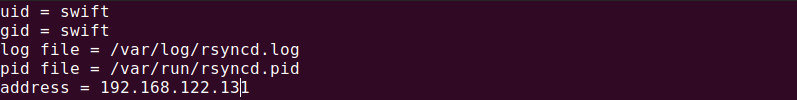

Now we will need to enable `rsync` with the following command

```bash
vim /etc/default/rsync
```

We change `RSYNC_ENABLE=true`

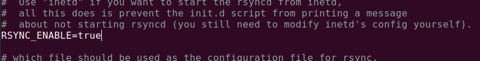

Now we will enable and start rsync

```bash
systemctl enable rsync
systemctl start rsync
```

If we can test `rsync`

```bash
rsync -rtv rsync://swift@192.168.122.131
```

We can see it's working


Now that we have `rsync` on the proxy node working we will start the memcached service

```bash
systemctl enable memcached
systemctl start memcached
```

We will edit two more files that we will copy from the swift git repository

```bash
cd /swift/etc
cp proxy-server.conf-sample /etc/swift/proxy-server.conf
cp swift.conf-sample /etc/swift/swift.conf
```

The `proxy-server.conf` has the `bind_ip` that we will update.

```bash
vim /etc/swift/proxy-server.conf
```

We change the bind ip to the proxy vm ip which is `192.168.122.131`


On line 173 we change the following statements to true

```bash
allow_account_management = true
account_autocreate = true
```

In the other file `swift.conf` that we copied, we need to add the 64-bit hash string. In a real-world deployment, these will be confidential

```bash
swift_hash_path_suffix = RzUfDdu32L7J2ZBDYgsD6YI3Xie7hTVO8/oaQbpTbI8=
swift_hash_path_prefix = OZ1uQJNjJzTuFaM8X3v%fsJ1iR#F8wJjf9uhRiABevQ4
```

First we use the following command to delete any old files we might have. If this is your first time making the ring files then no need to run this command.

```bash
rm -f *.builder *.ring.gz backups/*.builder backups/*.ring.gz
```

Now we will create ring files

```bash
cd /etc/swift
swift-ring-builder account.builder create 3 3 1
swift-ring-builder container.builder create 3 3 1
swift-ring-builder object.builder create 3 3 1
```

Our object vm ip address is `192.168.122.99`. We will use this ip to configure the ring files even though we still haven't configured our object server. The only way proxy-server knows about other nodes through out the swift installation is this ring file. So this ring in the proxy server is keeping the whole installation together. It is the brain of swift installation. The files we will now needs to be on the nodes of the deployment. We will copy these files to our object server soon. For example if we have five object servers then these files need to be copied in all the five object server

```bash
swift-ring-builder account.builder add r1z1-192.168.122.99:6002/d1 100
swift-ring-builder container.builder add r1z1-192.168.122.99:6001/d1 100
swift-ring-builder object.builder add r1z1-192.168.122.99:6000/d1 100

swift-ring-builder account.builder add r1z1-192.168.122.99:6002/d2 100
swift-ring-builder container.builder add r1z1-192.168.122.99:6001/d2 100
swift-ring-builder object.builder add r1z1-192.168.122.99:6000/d2 100

swift-ring-builder account.builder add r1z1-192.168.122.99:6002/d3 100
swift-ring-builder container.builder add r1z1-192.168.122.99:6001/d3 100
swift-ring-builder object.builder add r1z1-192.168.122.99:6000/d3 100

swift-ring-builder account.builder add r1z1-192.168.122.99:6002/d4 100
swift-ring-builder container.builder add r1z1-192.168.122.99:6001/d4 100
swift-ring-builder object.builder add r1z1-192.168.122.99:6000/d4 100
```

Once we have created the ring files we need to `rebalance` the ring. Every time we made any change in the ring files we will need to `rebalance` them

```bash
swift-ring-builder account.builder rebalance
swift-ring-builder container.builder rebalance
swift-ring-builder object.builder rebalance
```

we can check using the following command.

```bash
swift-ring-builder account.builder
```

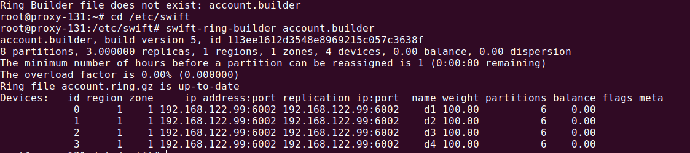

If we check our `/etc/swift` folder we can see there are few new files. We will need to copy these files to our object server.

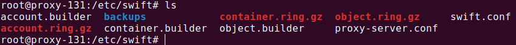

We are almost done with our proxy vm. Now we will just start our proxy service.

```bash
swift-init proxy start
```

We can see that `proxy-server` started without any complication


Now we will move on to the object server.

## **Object VM**

---

We need to install these dependencies like we did in the proxy vm

```bash
apt-get install curl gcc memcached rsync sqlite3 xfsprogs \
                    git-core libffi-dev python-setuptools \
                    liberasurecode-dev libssl-dev

apt-get install python-coverage python-dev python-nose \
                    python-xattr python-eventlet \
                    python-greenlet python-pastedeploy \
                    python-netifaces python-pip python-dnspython \
                    python-mock
apt update
```

```bash
git clone https://github.com/openstack/swift.git
cd swift
git checkout stable/train
pip install -r requirements.txt
python setup.py install
```

```bash
cd
mkdir -p /etc/swift
useradd swift
chmod -R 757 /etc/swift
apt update
```

We will configure rsync. This has to be done on all the vm. The process is exactly same as proxy vm

```bash
cd /swift/etc
cp rsyncd.conf-sample /etc/rsyncd.conf
cd /etc
vim rsyncd.conf
```

```bash
address = 192.168.122.99 # the ip address of the object vm
```


Enabling `rsync`

```bash
vim /etc/default/rsync
```

Changing `RSYNC_ENABLE=true`


Enabling and starting rsync services

```bash
systemctl enable rsync
systemctl start rsync
```

We have rsync configured and running on the object node. We will start the memcached services now

```bash
systemctl enable memcached
systemctl start memcached
```

So far on the object vm we did almost the same things we did on our proxy server. We will transfer all the files from **proxy vm** to the object vm. we run the following command on the **proxy vm**

```bash
scp -r /etc/swift/swift.conf rizwan@192.168.122.99:/etc/swift/
scp -r /etc/swift/*.ring.gz rizwan@192.168.122.99:/etc/swift/
```

If we check our `/etc/swift` folder in the object storage vm we can see the transferred files are there. These 4 files has to be same on all nodes of cluster.

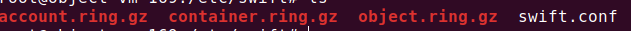

Now we need to copy some files from the swift repository that we cloned.

```bash
cd
cd /swift/etc
cp account-server.conf-sample /etc/swift/account-server.conf
cp container-server.conf-sample /etc/swift/container-server.conf
cp object-server.conf-sample /etc/swift/object-server.conf
cp drive-audit.conf-sample /etc/swift/drive-audit.conf
cp internal-client.conf-sample /etc/swift/internal-client.conf
cp container-reconciler.conf-sample /etc/swift/container-reconciler.conf
```

We can see our newly copied files in the `/etc/swift` of the object vm. We will edit 3 files from here. We need not to edit the other 3 files that we copied but they need to be there for swift to run it's services.


First we edit the `account-server.conf` file

```bash
cd /etc/swift
vim account-server.conf
```

We change the bind port to 192.168.122.99 which is the ip of our object storage vm. We also change the bind port to `6002`

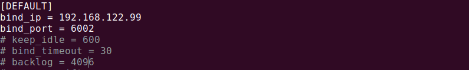

We do the same with `container-server.conf` where ip will be 192.168.122.99 and bind port will be `6001`

```bash
vim container-server.conf
```

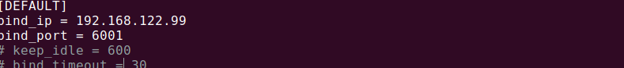

For `object-server.conf` we have the following

```bash
vim object-server.conf
```

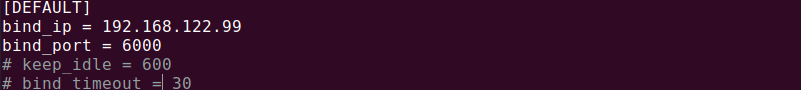

Now we need to mount the storage devices. We can see the block devices are there

```bash
ls /sys/block
```

We already added these to our vm using `virt-manager`

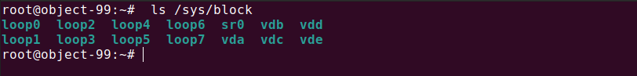

We will need to configure these devices

```bash
mkfs.xfs -f -L d1 /dev/vdb
mkfs.xfs -f -L d2 /dev/vdc
mkfs.xfs -f -L d3 /dev/vdd
mkfs.xfs -f -L d4 /dev/vde

mkdir -p /srv/node/d1
mkdir -p /srv/node/d2
mkdir -p /srv/node/d3
mkdir -p /srv/node/d4

mount -t xfs -o noatime,nodiratime,logbufs=8 -L d1 /srv/node/d1
mount -t xfs -o noatime,nodiratime,logbufs=8 -L d2 /srv/node/d2
mount -t xfs -o noatime,nodiratime,logbufs=8 -L d3 /srv/node/d3
mount -t xfs -o noatime,nodiratime,logbufs=8 -L d4 /srv/node/d4

chown -R swift:swift /srv/node
mount
```

We see can see the devices are mounted

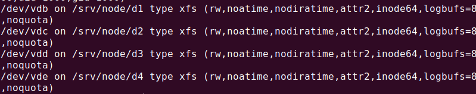

We will now start swift services

```bash
swift-init all start
```

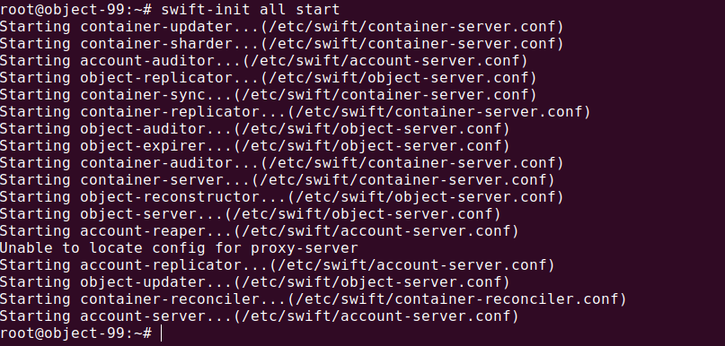

We are done with our installation process. Now we can send the following `curl` request from `proxy-vm` and verify that everything is working.

```bash
curl -v -H 'X-Auth-User: admin:admin' -H 'X-Auth-Key: admin' http://192.168.122.131:8080/auth/v1.0/
```

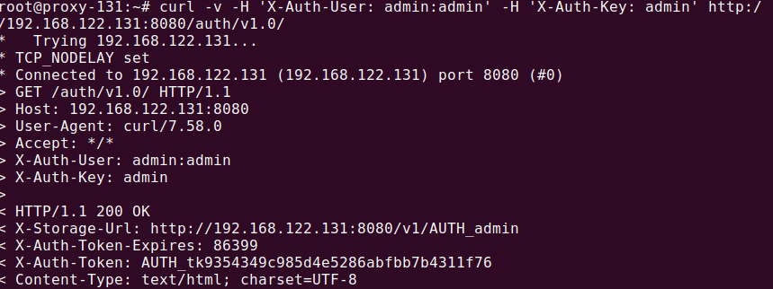

We get an auth token `AUTH_tk9354349c985d4e5286abfbb7b4311f76` that we use to send the following request.

```bash
curl -v -H 'X-Storage-Token: AUTH_tk9354349c985d4e5286abfbb7b4311f76' "http://192.168.122.131:8080/v1.0/AUTH_admin"
```

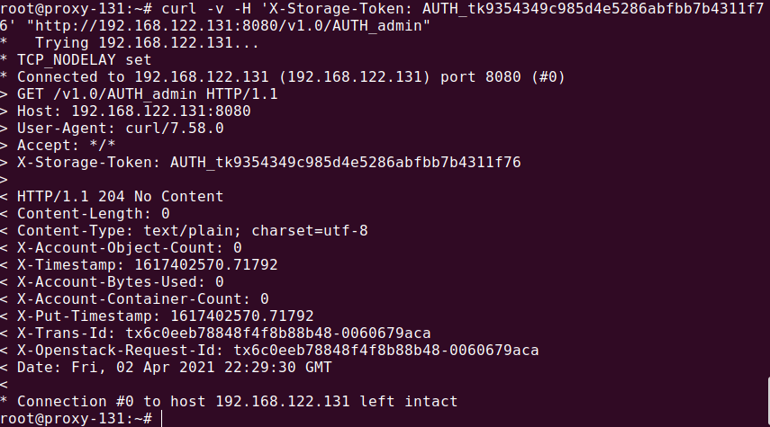

We can see we have successfully deployed swift in multiple vm
